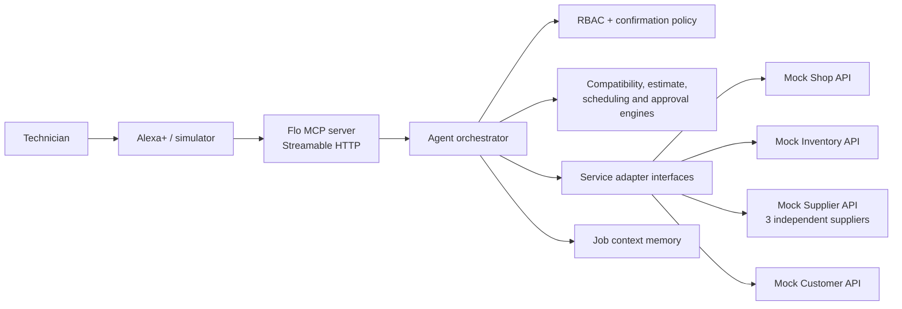
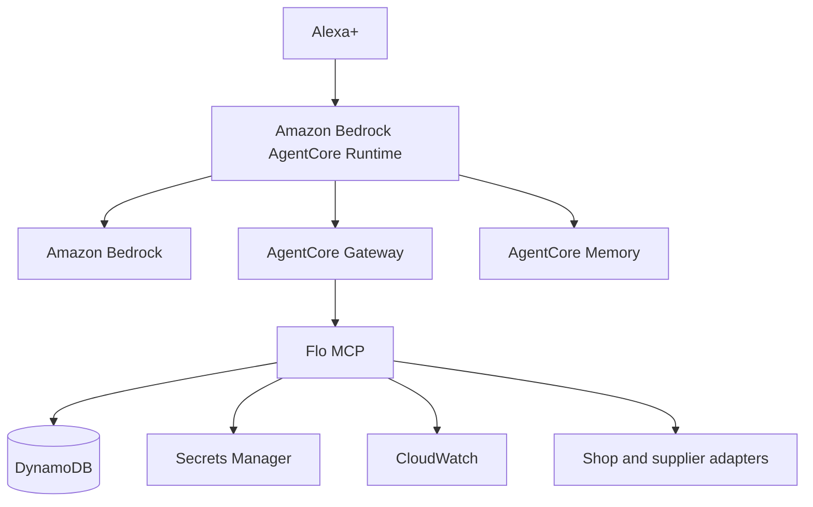

# Flo

**An open source MCP operating layer for hands-free service operations.**

Flo turns an Alexa+ conversation into a safe, resumable workflow across work orders, diagnostics, compatible parts, supplier availability, estimates, customer approvals, purchasing, and scheduling. The initial demonstration is an automotive repair shop, while the domain and adapter boundaries are intentionally usable by HVAC, plumbing, electrical, appliance repair, facilities, and industrial maintenance teams.

> Project status: the deterministic domain layer, four simulated service APIs, HTTP adapters, persistent job-context abstraction, transaction controls, Streamable HTTP MCP server, polished MCP-backed web simulator, and a narrow Amazon Bedrock narration adapter are implemented. Fourteen automated tests pass. Development mode exposes 28 tools; production omits the three demo-only controls. The Bedrock adapter is deployed through AWS CloudFormation and was live-invocation tested with Amazon Nova Lite on September 4, 2026. The official Alexa+ add-on connection, MCP App package, AgentCore runtime, and durable AWS state remain future work and are not claimed as live.

For the current competition evidence and remaining external release gates, see [`docs/hackathon/submission-readiness.md`](docs/hackathon/submission-readiness.md).

## The problem

Technicians often work with gloves, tools, lifts, machinery, and dirty parts. Looking up a job in one system, checking stock in another, comparing suppliers, rebuilding an estimate, contacting a customer, and then scheduling the repair forces repeated context switching at exactly the wrong moment.

Flo makes voice the operating interface, not a chat veneer. Every business fact comes from a structured service. Every mutation is an actual tool call. Money, compatibility, authorization, approvals, availability, and transaction state are resolved by deterministic code rather than invented by a language model.

## Demonstrated workflow

1. “Open work order 1842.”
2. “The alternator failed.”
3. “Find compatible replacements under $300 that can arrive tomorrow.”
4. “Which gives us the best margin without using the cheapest part?”
5. “Add it to the estimate and request approval.”
6. Simulate the customer approving the estimate.
7. Start a fresh conversational session: “What happened with the Ford?”
8. “Order the alternator and schedule the truck in Bay 2 tomorrow morning.”
9. Flo returns a transaction summary and executes nothing.
10. “Confirm.” Flo revalidates authorization, approval, offer, and schedule availability; then it places the order, reserves the bay, updates the work order, and writes audit records.

The integration test at `tests/integration/demo-workflow.test.ts` executes that entire stateful workflow. The transport test starts the MCP endpoint, negotiates protocol version `2025-11-25`, lists the live tools, and calls `get_work_order` through Streamable HTTP.

## Architecture



The MCP handlers are deliberately thin. The orchestrator coordinates work, adapters own service I/O, engines own deterministic rules, and service-layer checks guard protected mutations.

### Verified AWS Builder integration

The simulator can call a deployed AWS Lambda function that invokes Amazon Bedrock through the Converse API with `amazon.nova-lite-v1:0`. Bedrock produces only one short qualitative lead sentence for the parts-comparison response. The simulator sends no customer, vehicle, work-order, price, supplier, part-number, or free-form technician data. Flo validates the response and falls back locally if AWS is slow, unavailable, or returns a sentence outside the no-digits/no-prices contract. Deterministic code still chooses the part and owns every operational fact.

The CloudFormation stack `flo-bedrock-narrator` was verified `CREATE_COMPLETE` in `us-west-2`. A live request returned an accepted narration lead and the wrong-build-header path returned HTTP 403. The deployment template, IAM policy, failure contract, and setup instructions are in [`infra/aws/bedrock-narrator`](infra/aws/bedrock-narrator).

### Intended full AWS deployment



This diagram is the larger deployment target, not a claim that AgentCore, DynamoDB, or Secrets Manager are active. The current verified AWS surface is the Bedrock narration function described above; local business state remains in seeded stores behind replaceable interfaces. See `docs/architecture/aws.md` for the exact live/future boundary.

## Why Alexa+

Voice is useful here because the operator’s hands and attention are occupied. Short spoken responses communicate the recommendation or pending state; visual surfaces should carry detailed part comparisons, estimates, approvals, schedule conflicts, and timelines. Flo never reports a transactional action as complete until the service confirms it.

The official Alexa+ MCP Toolkit is the intended integration path because Flo already owns an MCP server and needs direct control over tools, structured data, and future MCP App rendering. The server and transport test use the toolkit-supported MCP `2025-11-25` revision over Streamable HTTP. The current web simulator is a custom development and demo surface—not an official Alexa+ simulator or deployed add-on. See `docs/alexa-plus-fit-audit.md` for the evidence, fixes, and remaining certification work.

The visual simulator follows the Alexa+ design guidance in the areas that can be validated locally: large arm’s-length typography, a low-density work card, 48-pixel touch targets, light and dark themes, voice/text parity, a three-item horizontal comparison pattern, and a customer-controlled expanded view. Alexa+ itself will generate its spoken response from MCP structured output; the wording shown by the local simulator is explicitly a simulated response generated from the same structured result.

## Deterministic safeguards

- Compatibility is exact seeded fitment data evaluated by year, make, model, trim, engine, category, and part number. Results are `compatible`, `incompatible`, or `unknown` with explanation codes.
- All money uses integer cents and basis points. The seeded Supplier B estimate calculates $219.00 shop cost, 35% markup, $295.65 customer part price, 1.2 hours at $105, $12 shop supplies, $25.38 tax, and a $459.03 total.
- Role permissions are enforced before service operations.
- Customer approval must be current and approved before purchase preparation.
- Purchases and scheduling require a short-lived, actor-bound, single-use confirmation token.
- Confirmation rechecks the approval and Bay 2 availability instead of trusting stale conversational state.
- Supplier order idempotency keys prevent duplicate purchases.
- Structured audit events omit unnecessary customer contact details.
- A recent active work order can resolve “the Ford”; multiple plausible matches without sufficient context yield an ambiguity error.

## MCP tools

Flo registers 25 production tools and adds three local demo controls in non-production environments, for 28 development tools:

| Area | Tools |
| --- | --- |
| Work orders | `get_work_order`, `list_open_work_orders`, `search_work_orders`, `add_work_order_note`, `get_job_status` |
| Assets and diagnostics | `get_asset`, `record_diagnostic`, `get_diagnostic_history` |
| Parts and inventory | `search_parts`, `check_part_compatibility`, `search_inventory`, `search_suppliers`, `compare_parts` |
| Estimates | `calculate_estimate`, `create_estimate`, `get_estimate` |
| Customer and approval | `get_customer`, `send_customer_message`, `request_customer_approval`, `get_customer_approval_status` |
| Purchase and schedule | `get_schedule`, `find_available_slot`, `prepare_purchase_and_schedule`, `confirm_transaction`, `get_order_status` |
| Non-production demo operations | `simulate_customer_approval`, `get_demo_time_window`, `reset_demo` |

Each tool has a Zod input schema, output envelope, annotations, structured errors, and latency/success logging. External side effects are marked destructive. The purchase/schedule action is split into explicit prepare and confirm tools so the server—not merely a prompt—enforces the gate.

## Repository structure

```text
flo/
├─ apps/
│  └─ alexa-simulator/           # MCP-backed voice workflow and visual panels
├─ packages/
│  ├─ shared-types/              # actors, roles, errors, results
│  ├─ domain/                    # schemas, seed data, permissions
│  ├─ adapters/                  # interfaces and HTTP implementations
│  ├─ compatibility-engine/      # deterministic fitment + ranking
│  ├─ estimate-engine/           # deterministic pricing
│  └─ agent/                     # orchestration, memory, safety gates
├─ services/
│  ├─ flo-mcp/             # Streamable HTTP MCP endpoint
│  ├─ mock-shop-api/
│  ├─ mock-inventory-api/
│  ├─ mock-supplier-api/
│  └─ mock-customer-api/
├─ tests/integration/            # complete workflow + MCP transport
├─ docs/                         # architecture, demo, and submission material
└─ scripts/                      # test runner and demo reset
```

## Requirements

- Node.js 22 or newer
- pnpm 11

No AWS account, commercial supplier key, or private repair-shop integration is needed for the local demo.

## Local setup

```bash
cp .env.example .env
pnpm install
pnpm build
pnpm test
pnpm dev:services
```

Service endpoints:

| Service | URL |
| --- | --- |
| MCP | `http://127.0.0.1:4100/mcp` |
| MCP health | `http://127.0.0.1:4100/health` |
| Shop | `http://127.0.0.1:4101` |
| Inventory | `http://127.0.0.1:4102` |
| Supplier | `http://127.0.0.1:4103` |
| Customer | `http://127.0.0.1:4104` |
| Alexa simulator | `http://127.0.0.1:4200` |

In local demo mode, MCP requests can set `x-flo-role` to `technician`, `service_advisor`, `manager`, or `administrator`. Production mode must authenticate identities and must not trust a caller-selected role header.

## Commands

```bash
pnpm build              # compile every workspace package
pnpm test               # run compiled unit and integration tests
pnpm test:unit
pnpm test:integration
pnpm typecheck
pnpm lint
pnpm dev:services       # start mock APIs and MCP
pnpm dev                # start mock APIs, MCP, and simulator
pnpm demo:reset         # restore deterministic seed state on running services
```

`pnpm demo:reset` resets work order 1842, estimates, approvals, supplier orders, inventory reservations, schedule state, and MCP job memory. Dates are generated relative to the reset day so “tomorrow” remains repeatable.

## Testing

The suite covers:

- compatible, incompatible, and ranked part choices;
- integer-cent estimate calculations;
- adapter-backed authorization behavior;
- the complete diagnosis-to-schedule workflow;
- approval and confirmation state transitions;
- persistent context across orchestrator instances;
- duplicate confirmation rejection; and
- actual MCP 2025-11-25 Streamable HTTP negotiation and tool execution.

Run the same quality gates used by CI:

```bash
pnpm lint
pnpm typecheck
pnpm build
pnpm test
```

## Adding an integration

Implement the relevant interface in `packages/adapters`, validate the provider response into Flo domain types, and inject the adapter into the orchestrator. The supplier contract includes search, availability, order, status, cancel, and reset operations. `MockSupplierAdapter` is intentionally an HTTP implementation rather than a frontend fixture, so a future Napa, AutoZone, dealer, Amazon Business, or generic ERP adapter can replace it without changing the MCP surface. See `docs/api/adding-an-adapter.md`.

No commercial integrations are claimed in this repository.

## Security

Read `SECURITY.md` and `docs/architecture/security.md`. The current local mode is for a seeded demonstration. Before exposing it publicly, replace the demo actor headers with verified identity, persist confirmation records and idempotency keys, configure TLS and an allowed origin/host list, move secrets to Secrets Manager, and use a durable state store.

## Hackathon material

- `docs/demo/demo-script.md` — under-three-minute walkthrough
- `docs/hackathon/devpost-submission.md` — evidence-conscious submission draft
- `docs/hackathon/friction-log.md` — constructive development friction log
- `docs/hackathon/product-feedback.md` — completion feedback draft

## Roadmap

1. Package the visual results as MCP App resources with declared CSP and Alexa+ host-context adaptation.
2. Expand the existing Bedrock narration adapter into an evaluated planning adapter while retaining deterministic business functions.
3. Run the orchestrator in AgentCore Runtime and move job context into AgentCore Memory.
4. Persist operational records in DynamoDB and send structured metrics to CloudWatch.
5. Add verified authentication through AgentCore Identity or the deployment’s identity provider.
6. Validate the complete flow through the current Alexa+ developer surface and certification checklist when partner access is available.

## Open source

Flo is licensed under the [MIT License](LICENSE). Contributions should keep adapter boundaries industry-neutral and preserve the rule that deterministic systems—not a model—own money, compatibility, authorization, inventory, approvals, and transaction state.
