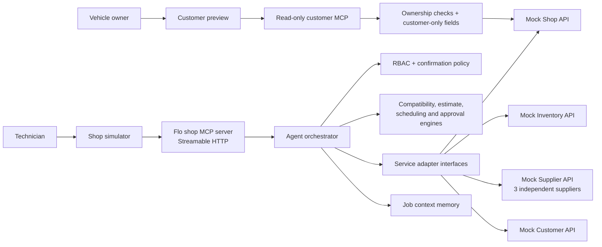
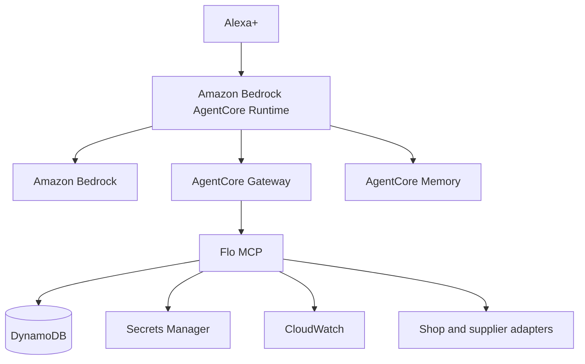

# Flo

**An open source MCP operating layer for hands-free service operations.**

Flo connects conversational commands to structured repair information and service workflows through MCP. The vehicle-owner preview reviews repair status and customer estimates. The separate shop demo covers diagnostics, compatible parts, supplier availability, approvals, purchasing and scheduling. Both are custom simulations, not a deployed Alexa+ add-on. The adapter boundaries remain extensible beyond automotive repair.

> Project status: local deterministic engines, four simulated APIs, shop workflow, transaction controls, MCP transport and a read-only vehicle-owner preview are implemented. `/mcp` exposes 28 shop tools in demo mode (25 otherwise); `/customer/mcp` exposes three separate read-only tools only in demo mode and returns 401 otherwise. A separate AWS-hosted customer website supports Login with Amazon and durable sessions; sign-in does not grant repair ownership. Its new fictional-customer enrollment services are implemented and locally tested but not deployed. The narrow Bedrock narrator has recorded live verification. Official Alexa+ account linking, deployment, certification, MCP App packaging, AgentCore and durable shop business state remain incomplete.

**Certification is a separate gate from the hackathon.** Alexa+ policy excludes exclusively internal/B2B add-ons. The vehicle-owner preview is the first consumer-facing increment, not a certification-ready release. See the [complete documentation review and implementation tracker](docs/alexa-plus-certification-plan.md).

For the current competition evidence and remaining external release gates, see [`docs/hackathon/submission-readiness.md`](docs/hackathon/submission-readiness.md).

## The problem

Technicians often work with gloves, tools, lifts, machinery, and dirty parts. Looking up a job in one system, checking stock in another, comparing suppliers, rebuilding an estimate, contacting a customer, and then scheduling the repair forces repeated context switching at exactly the wrong moment.

Flo makes voice the operating interface, not a chat veneer. Every business fact comes from a structured service. Every mutation is an actual tool call. Money, compatibility, authorization, approvals, availability, and transaction state are resolved by deterministic code rather than invented by a language model.

## Vehicle-owner preview

Open `http://127.0.0.1:4200/`, acknowledge the synthetic-data notice, and try “Show my repairs,” “Status of repair 1842,” or “Review estimate 1842.” The estimate becomes available after the shop demo creates it; before that, Flo explicitly says it is not ready. Customer prices omit supplier cost and shop margin. Read-aloud is optional; no voice recognition or general-purpose language model is claimed for this preview. Start over clears the browser conversation, not repair records.

The fixed fictional owner is chosen server-side, not from tool arguments or request headers. Owner tools do not approve work, schedule appointments, order parts or charge anything. This simulator does not become authenticated when the separate website is configured.

### Separate Login with Amazon website

`pnpm --filter @flo/mcp start:customer` (after building) starts an isolated customer-only website on loopback port 4400. It is disabled by default. The implementation exchanges Amazon authorization codes server-side, validates audience/user identity, creates short-lived HttpOnly sessions and requires a trusted operator-maintained Amazon-ID-to-shop-customer mapping before any repair access. Signing in does **not** establish repair ownership. Tests use simulated Amazon responses, not real Amazon credentials.

The separate [AWS staging website](https://i4ceh4qpdg.execute-api.us-west-2.amazonaws.com/) is deployed. The owner reported successful real Amazon sign-in/sign-out, and the authenticated-unlinked UI was inspected; it keeps repair information blocked pending shop verification. The [deployment evidence](docs/verification/customer-unlinked-ui-deployment-2026-09-05.md) distinguishes those observations from still-incomplete hosted enrollment and linked-customer tests. Fictional-customer enrollment, private operator permissions and real-customer ownership verification are not deployed or proven by website sign-in. Website sessions and AWS service credentials cannot unlock the website's closed Alexa routes. Follow the [identity architecture and controlled setup guide](docs/architecture/customer-identity.md); do not expose the shop demo or raw mock APIs. This is not a certification-ready release.

## Shop demonstration workflow

Open `http://127.0.0.1:4200/shop` for the original operational simulation. It is not the consumer add-on surface.

1. “Open work order 1842.”
2. “The alternator failed.”
3. “Find compatible replacements under $300 that can arrive tomorrow.”
4. “Which gives us the best margin without using the cheapest part?”
5. “Add it to the estimate and request approval.”
6. Simulate the customer approving the estimate.
7. Start a fresh conversational session: “What happened with the Ford?”
8. “Order the alternator and schedule the truck in Bay 2 tomorrow morning.”
9. Flo returns a transaction summary and executes nothing.
10. “Confirm.” Flo revalidates authorization, approval, offer, and schedule availability; then it places the order, reserves the bay, updates the work order, and writes audit records.

The integration test at `tests/integration/demo-workflow.test.ts` exercises the stateful workflow using the balanced recommendation and separately verifies gross-profit sorting. The local “best margin” command explicitly interprets margin as gross part profit in dollars, not percentage: it selects the $289 option with $101.15 gross part profit, not the balanced $219 option. The existing video predates this correction and must be reconciled before release. The transport test negotiates `2025-11-25` and invokes real MCP tools.

## Architecture



The MCP handlers are deliberately thin. The orchestrator coordinates work, adapters own service I/O, engines own deterministic rules, and service-layer checks guard protected mutations.

### Verified AWS Builder integration

The simulator can call a deployed AWS Lambda function that invokes Amazon Bedrock through the Converse API with `amazon.nova-lite-v1:0`. Bedrock produces only one short qualitative lead sentence for the parts-comparison response. The simulator sends no customer, vehicle, work-order, price, supplier, part-number, or free-form technician data. Flo validates the response and falls back locally if AWS is slow, unavailable, or returns a sentence outside the no-digits/no-prices contract. Deterministic code still chooses the part and owns every operational fact.

The [recorded September 4 deployment verification](docs/verification/aws-protection-2026-09-04.md) documents `flo-bedrock-narrator` reaching `UPDATE_COMPLETE` in `us-west-2`, successful signed narration, rejected unsigned/invalid requests, seven-day log retention and a retained DynamoDB model-attempt allowance. Caller authentication is IAM/SigV4; a build marker is not authentication. The allowance and throttling are not an account-wide dollar cap. The shop simulator needs an authorized server-side AWS identity for optional narration and otherwise falls back locally. The vehicle-owner preview never calls Bedrock. No AWS credentials belong in browser code.

### Intended full AWS deployment



This diagram is the larger deployment target, not a deployed architecture. DynamoDB is used for the narrator's finite invocation allowance, not for work orders or customer memory. AgentCore and Secrets Manager remain planned. Local business state remains in seeded, in-memory stores. See `docs/architecture/aws.md` for the recorded live/future boundary.

## Why Alexa+

Voice is useful here because the operator’s hands and attention are occupied. Short spoken responses communicate the recommendation or pending state; visual surfaces should carry detailed part comparisons, estimates, approvals, schedule conflicts, and timelines. Flo never reports a transactional action as complete until the service confirms it.

MCP Toolkit is the current prototype route for bespoke repair information. A future consumer booking feature also requires evaluating Category Action Local Booking with Amazon. The transport test checks MCP `2025-11-25` over Streamable HTTP. Neither Flo browser interface is Amazon's official Web Simulator or an MCP App resource. See the [certification tracker](docs/alexa-plus-certification-plan.md) for the current route decision and remaining gates.

The visual simulator follows the Alexa+ design guidance in the areas that can be validated locally: large arm’s-length typography, a low-density work card, 48-pixel touch targets, light and dark themes, voice/text parity, a three-item horizontal comparison pattern, and a customer-controlled expanded view. Alexa+ itself will generate its spoken response from MCP structured output; the wording shown by the local simulator is explicitly a simulated response generated from the same structured result.

## Deterministic safeguards

- Compatibility is exact seeded fitment data evaluated by year, make, model, trim, engine, category, and part number. Results are `compatible`, `incompatible`, or `unknown` with explanation codes.
- All money uses integer cents and basis points. The seeded Supplier B estimate calculates $219.00 shop cost, 35% markup, $295.65 customer part price, 1.2 hours at $105, $12 shop supplies, $25.38 tax, and a $459.03 total.
- Role permissions are enforced before service operations.
- Customer approval must be current and approved before purchase preparation.
- Purchases and scheduling require a short-lived, actor-bound, single-use confirmation token.
- Confirmation rechecks the approval and Bay 2 availability instead of trusting stale conversational state.
- Supplier order idempotency keys prevent duplicate purchases.
- Structured audit events omit unnecessary customer contact details.
- A recent active work order can resolve “the Ford”; multiple plausible matches without sufficient context yield an ambiguity error.

## MCP tools

The shop MCP surface registers 25 non-demo tools and adds three local demo controls, for 28 development tools. A non-demo tool surface does not make this mock backend production-ready. The separate customer route registers `list_my_repairs`, `get_my_repair` and `get_my_estimate`; it does not expose the following shop tools:

| Area | Tools |
| --- | --- |
| Work orders | `get_work_order`, `list_open_work_orders`, `search_work_orders`, `add_work_order_note`, `get_job_status` |
| Assets and diagnostics | `get_asset`, `record_diagnostic`, `get_diagnostic_history` |
| Parts and inventory | `search_parts`, `check_part_compatibility`, `search_inventory`, `search_suppliers`, `compare_parts` |
| Estimates | `calculate_estimate`, `create_estimate`, `get_estimate` |
| Customer and approval | `get_customer`, `send_customer_message`, `request_customer_approval`, `get_customer_approval_status` |
| Purchase and schedule | `get_schedule`, `find_available_slot`, `prepare_purchase_and_schedule`, `confirm_transaction`, `get_order_status` |
| Non-production demo operations | `simulate_customer_approval`, `get_demo_time_window`, `reset_demo` |

Each tool has a Zod input schema, output envelope, annotations, structured errors, and latency/success logging. External side effects are marked destructive. The purchase/schedule action is split into explicit prepare and confirm tools so the server—not merely a prompt—enforces the gate.

## Repository structure

```text
flo/
├─ apps/
│  └─ alexa-simulator/           # MCP-backed voice workflow and visual panels
├─ packages/
│  ├─ shared-types/              # actors, roles, errors, results
│  ├─ domain/                    # schemas, seed data, permissions
│  ├─ adapters/                  # interfaces and HTTP implementations
│  ├─ compatibility-engine/      # deterministic fitment + ranking
│  ├─ estimate-engine/           # deterministic pricing
│  └─ agent/                     # orchestration, memory, safety gates
├─ services/
│  ├─ flo-mcp/             # Streamable HTTP MCP endpoint
│  ├─ mock-shop-api/
│  ├─ mock-inventory-api/
│  ├─ mock-supplier-api/
│  └─ mock-customer-api/
├─ tests/integration/            # complete workflow + MCP transport
├─ docs/                         # architecture, demo, and submission material
└─ scripts/                      # test runner and demo reset
```

## Requirements

- Node.js 22 or newer
- pnpm 11

No AWS account, commercial supplier key, or private repair-shop integration is needed for the local demo.

## Local setup

```bash
cp .env.example .env
pnpm install
pnpm build
pnpm test
pnpm dev
```

Service endpoints:

| Service | URL |
| --- | --- |
| MCP | `http://127.0.0.1:4100/mcp` |
| Customer MCP (demo only) | `http://127.0.0.1:4100/customer/mcp` |
| MCP health | `http://127.0.0.1:4100/health` |
| Shop | `http://127.0.0.1:4101` |
| Inventory | `http://127.0.0.1:4102` |
| Supplier | `http://127.0.0.1:4103` |
| Customer | `http://127.0.0.1:4104` |
| Vehicle-owner preview | `http://127.0.0.1:4200/` |
| Shop simulator | `http://127.0.0.1:4200/shop` |

In local demo mode, MCP requests can set `x-flo-role` to `technician`, `service_advisor`, `manager`, or `administrator`. Production mode must authenticate identities and must not trust a caller-selected role header.

## Commands

```bash
pnpm build              # compile every workspace package
pnpm test               # run compiled unit and integration tests
pnpm test:unit
pnpm test:integration
pnpm typecheck
pnpm lint
pnpm dev:services       # start mock APIs and MCP
pnpm dev                # start mock APIs, MCP, and simulator
pnpm demo:reset         # restore deterministic seed state on running services
```

`pnpm demo:reset` resets work order 1842, estimates, approvals, supplier orders, inventory reservations, schedule state, and MCP job memory. Dates are generated relative to the reset day so “tomorrow” remains repeatable.

## Testing

The suite covers:

- compatible, incompatible, and ranked part choices;
- integer-cent estimate calculations;
- adapter-backed authorization behavior;
- owner-only repair access, cross-job estimate rejection, private-field projection, and customer-route production denial;
- the complete diagnosis-to-schedule workflow;
- approval and confirmation state transitions;
- persistent context across orchestrator instances;
- duplicate confirmation rejection; and
- actual MCP 2025-11-25 Streamable HTTP negotiation and tool execution.

Run the same quality gates used by CI:

```bash
pnpm lint
pnpm typecheck
pnpm build
pnpm test
```

## Adding an integration

Implement the relevant interface in `packages/adapters`, validate the provider response into Flo domain types, and inject the adapter into the orchestrator. The supplier contract includes search, availability, order, status, cancel, and reset operations. `MockSupplierAdapter` is intentionally an HTTP implementation rather than a frontend fixture, so a future Napa, AutoZone, dealer, Amazon Business, or generic ERP adapter can replace it without changing the MCP surface. See `docs/api/adding-an-adapter.md`.

No commercial integrations are claimed in this repository.

## Security

Read `SECURITY.md` and `docs/architecture/security.md`. The current local mode is for a seeded demonstration. Before exposing it publicly, replace the demo actor headers with verified identity, persist confirmation records and idempotency keys, configure TLS and an allowed origin/host list, move secrets to Secrets Manager, and use a durable state store.

## Hackathon material

- `docs/demo/demo-script.md` — under-three-minute walkthrough
- `docs/demo/flo-demo.en.vtt` — reviewed English captions for the [2:41 demo video](https://youtu.be/ZjROvjL2smo)
- `docs/hackathon/devpost-submission.md` — evidence-conscious submission draft
- `docs/hackathon/friction-log.md` — constructive development friction log
- `docs/hackathon/product-feedback.md` — completion feedback draft
- [Public source repository](https://github.com/agammann/flo)

## Roadmap

1. Package the visual results as MCP App resources with declared CSP and Alexa+ host-context adaptation.
2. Expand the existing Bedrock narration adapter into an evaluated planning adapter while retaining deterministic business functions.
3. Run the orchestrator in AgentCore Runtime and move job context into AgentCore Memory.
4. Persist operational records in DynamoDB and send structured metrics to CloudWatch.
5. Add verified authentication through AgentCore Identity or the deployment’s identity provider.
6. Complete the consumer experience, verified account linking, privacy/terms and lifecycle tests; validate through official Alexa+ tooling and certification when access is confirmed.

## Open source

Flo is licensed under the [MIT License](LICENSE). Contributions should keep adapter boundaries industry-neutral and preserve the rule that deterministic systems—not a model—own money, compatibility, authorization, inventory, approvals, and transaction state.
