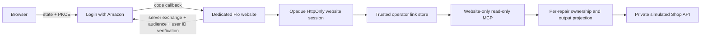

# Flo customer identity: Login with Amazon

Current staging supplement: the durable Lambda/DynamoDB website and real LWA configuration are deployed. The owner reports successful hosted sign-in/sign-out; direct browser inspection confirmed the corrected authenticated-unlinked screen, retained Sign out, and hidden sign-in/repair controls. Trusted customer enrollment and hosted linked/wrong-customer tests remain incomplete. See [UI deployment evidence](../verification/customer-unlinked-ui-deployment-2026-09-05.md) and [the enrollment gate](../verification/customer-enrollment-next-step-2026-09-05.md). The loopback/file/in-memory sections below describe the earlier local implementation, not the deployed storage model.

Earlier implementation checkpoint: local simulated-provider contract and HTTP/MCP tests. The current supplement above supersedes this checkpoint for hosted website login only. **Real repair enrollment, official Alexa+ linking and certification are not verified.** This remains a limited, read-only staging website, not a production customer service.

## Three distinct trust boundaries

| Credential or assertion | What it establishes | What it cannot establish |
| --- | --- | --- |
| Server-verified Login with Amazon authorization code and user ID | Amazon identity for the configured client/security profile | Ownership of a repair, shop role, AWS permissions, or official Alexa+ linking |
| Operator-maintained `(LWA client ID, Amazon user ID) → shop customer ID` record | The shop's verified association, subject to an active link and per-record ownership checks | Authority to view another customer's repairs or mutate any repair |
| AWS IAM/SigV4 narrator credential | Permission for the separate AWS narrator API | Customer sign-in, repair ownership, or MCP user authorization |



The existing simulator on 4200/4300 is still a synthetic-data demo. Its header-based shop actors are not production authentication. The new entrypoint listens on loopback port 4400 and does not mount the staff, reset, raw mock API, or simulator command routes.

## Configure a controlled live sign-in test

1. With the owner's approval, register or select Flo's Login with Amazon Security Profile. Register exactly `https://<approved-host>/auth/lwa/callback` as an allowed return URL. Review the profile's branding, privacy URL and applicable Amazon requirements before enabling it. Do not accept terms or create broader access on the owner's behalf without approval.
2. Provide a trusted HTTPS reverse proxy to the dedicated loopback customer website only. Do not expose ports for the shop demo or raw mock APIs. Set a fixed canonical `FLO_CUSTOMER_PUBLIC_ORIGIN` without a trailing slash. Configure `FLO_CUSTOMER_TRUSTED_PROXY_ADDRESSES=127.0.0.1` for an IPv4 local proxy (or `::1` for IPv6). The proxy must **overwrite** `X-Flo-Client-IP` with its transport client address, not retain or append a client-supplied value. Other peers' forwarded headers are ignored; missing/malformed identity from a trusted proxy fails closed. Block access logging of `/auth/lwa/callback` query strings; redact cookies, authorization headers and provider URLs in proxy/APM traces. The documented tokeninfo request contains a token query parameter and must not be logged.
3. Supply `LWA_ENABLED=true`, `LWA_CLIENT_ID`, `LWA_CLIENT_SECRET`, `FLO_CUSTOMER_PUBLIC_ORIGIN`, and `FLO_CUSTOMER_LINKS_FILE` through the server's private runtime configuration. Never put the secret into browser code, chat, screenshots or Git. If using Secrets Manager, inject at runtime through an approved secret wrapper such as `asm-exec` using `{{resolve:secretsmanager:...}}`; do not fetch secret plaintext into an agent tool response. This repository does not provision a secret or claim a deployed Secrets Manager integration.
4. Keep the private bindings file outside the repository and web root, with read access for the service account and write access only for the trusted shop operator. A file under `.private/` is ignored as a defense in depth, not an access-control mechanism. An absent, malformed, duplicate-identity or wrong-client file fails closed.
5. Run `pnpm build`, then `pnpm --filter @flo/mcp start:customer`. The default unconfigured page is available at `http://127.0.0.1:4400/`; **real sign-in requires the registered HTTPS origin** because the session/state cookies are Secure. Start the private simulated Shop API separately. Do not load real customer records into this prototype.

No AWS credentials are needed for this website sign-in flow. The LWA server client secret and the narrator's IAM credentials serve different systems.

For an NGINX TLS virtual host, the relevant proxy location is shown below (certificate and exact server name configuration are deployment-specific and are not supplied by this snippet). NGINX's [`proxy_set_header`](https://nginx.org/en/docs/http/ngx_http_proxy_module.html#proxy_set_header) replaces the header sent upstream. Do not configure `real_ip_header` to trust arbitrary clients; `$remote_addr` must remain a trustworthy socket address. A CDN/load-balancer chain requires a separately reviewed trusted-client-IP boundary, not a copied X-Forwarded-For value.

```nginx
location / {
    access_log off;
    proxy_set_header X-Flo-Client-IP $remote_addr;
    proxy_set_header Host $host;
    proxy_pass http://127.0.0.1:4400;
}
```

Login admission permits five outstanding states and twenty starts per five minutes per verified source, with a global 1,000-entry cap on both pending states and admission buckets. A restart clears these single-process maps. Superseding a browser's state invalidates the previous state but still counts toward its source quota. Shared NAT users share a source allowance; distributed attacks and deployment-wide quotas require additional ingress controls and shared storage. Do not enable the loopback TLS entrypoint without its explicit trusted-proxy configuration.

## Trusted repair association

Example schema only; placeholders are not valid evidence of ownership:

```json
{
  "version": 1,
  "clientId": "<the configured LWA client ID>",
  "links": [
    {
      "amazonUserId": "<server-verified Amazon user ID>",
      "customerId": "<shop-verified customer record ID>",
      "active": true
    }
  ]
}
```

An authorized shop operator must verify the person's authority using the shop's established process and associate that record with an Amazon ID obtained from a trusted, authenticated enrollment process. **Never copy a caller-typed ID, match an email automatically, or treat possession of a repair number/VIN as sufficient verification.** Customer IDs, roles and ownership assertions are not accepted through website commands or MCP arguments.

This increment implements the restrictive link-store adapter, not a production enrollment/admin workflow. Before onboarding real people, implement and review a secure, auditable pairing workflow (for example a short-lived, single-use invitation sent through an independently verified shop contact and redeemed by an authenticated user), recovery, unlinking, retention and operator authorization. Do not populate a real mapping merely to make a demo succeed. There is no public endpoint that creates or changes mappings.

Remove or deactivate a link to revoke access; the server rereads links on protected requests. New writes should be atomic and reviewed. Multiple records for the same Amazon ID are rejected. Shop data is still independently checked for work-order and estimate ownership.

## Website session behavior

- Authorization code exchange is server-side against fixed official endpoints, using browser-bound random state and PKCE S256. It requests only `profile:user_id`, validates the app audience and reads the Amazon user ID. Email/name are not retained or used for mapping.
- Browser sessions are random opaque identifiers in Secure, HttpOnly, SameSite cookies. Session map keys are hashed. Amazon access tokens remain server-side, never returned to the UI. Maximum session life is 15 minutes or the provider expiry, whichever is shorter; there is no refresh-token storage.
- The provider profile is checked again on protected requests. Expired/revoked/malformed credentials deny access. Provider network failures fail closed. Provider requests time out and response bodies are bounded.
- Sessions and login state are single-process in-memory data. Restart signs everyone out; scaling requires a separately designed shared session/revocation store. The private mapping file persists, but mock work orders/estimates do not.
- Logout invalidates the Flo session, clears cookies and displayed repair details, aborts browser requests, and blocks late response repaint. It does not sign the person out of Amazon or remove the shop's mapping.
- All responses use `no-store`; CSP forbids framing, external scripts, inline script, and cross-origin connections. Mutating website requests require the exact configured Origin and bounded JSON. Production load/rate controls, TLS/proxy hardening and browser privacy review remain required.

## Endpoint separation

| Endpoint on the dedicated website | Authorization and behavior |
| --- | --- |
| `/auth/lwa/start`, `/auth/lwa/callback` | Website authorization-code login, browser state, PKCE, no repair ownership inferred |
| `/auth/session`, `/auth/logout` | Website session status and local logout |
| `/api/customer/command` | Website cookie, trusted mapping, strict read-only command input; invokes real MCP tools |
| `/website/mcp` | Website BFF's opaque session bearer; only owner list/status/estimate tools |
| `/mcp`, `/customer/mcp`, `/alexa/mcp` | Denied, even after successful website sign-in. Official Alexa service/user authorization is not configured here. |

Do not put `/website/mcp` into an Alexa manifest. A successful website login does not implement protected-resource discovery, Alexa client registration, resource/scope checks, the service authorization tier, refresh or the official linking lifecycle. Those require separate implementation and official positive/negative tests. Returning 401 is an enforced closure, not proof of a working official service-auth flow.

## Official sources

- [Login with Amazon authorization code grant](https://developer.amazon.com/docs/login-with-amazon/authorization-code-grant.html)
- [Obtain customer profile and validate token audience](https://developer.amazon.com/docs/login-with-amazon/obtain-customer-profile.html)
- [Alexa+ MCP account linking](https://developer.amazon.com/docs/alexaplus/add-ons/mcp-toolkit-account-linking.html)
- [Alexa+ MCP authentication](https://developer.amazon.com/docs/alexaplus/add-ons/mcp-toolkit-authentication.html)

Review date: September 5, 2026. Live setup and release evidence must be recorded separately from mocked provider tests.

## Additional registration evidence, September 5

The signed-in [LWA console](https://developer.amazon.com/loginwithamazon/console/site/lwa/overview.html) displayed that Login with Amazon had not been set up on this account. The creation form was opened read-only and requires Security Profile Name, Description and Consent Privacy Notice URL; a logo is optional. Nothing was saved and no credentials were created or revealed.

The [Security Profile guide](https://developer.amazon.com/docs/login-with-amazon/security-profile.html) requires an LWA-enabled profile and a privacy notice; its older text documents client identifiers up to 100 bytes and client secrets up to 64 bytes. The original Flo validator copied that secret limit, but current [Amazon LWA credential examples](https://developer-docs.amazon/sp-api/docs/onboarding-step-5-make-your-first-call-to-the-sp-api-sandbox) include a provider prefix. Flo now accepts opaque, nonempty printable-ASCII secrets up to an application-defined 1024-byte configuration bound and sends them unchanged; this is not a claim about Amazon's maximum or credential validity. The client identifier limit remains 100 bytes. The [website registration guide](https://developer.amazon.com/docs/login-with-amazon/register-web.html) distinguishes popup SDK Allowed Origins from redirect-flow Allowed Return URLs. Flo uses the redirect flow. The now-registered staging origin and exact callback are recorded in [the registration evidence](../verification/lwa-registration-2026-09-05.md). The privacy URL must point to Flo's reviewed notice, not to an Amazon documentation page or a generic project README. A successful hosted exchange is still required to verify the actual credential.

The supplied [React Native for Vega URL reference](https://developer.amazon.com/docs/react-native-vega/0.83/global-URL) describes a runtime URL class and a trailing-slash bug fix. It neither provides hosting nor registers OAuth callbacks. Flo uses Node/browser JavaScript, not React Native for Vega. Keep the origin and exact callback distinct; no Vega package or URL polyfill is needed for this website implementation.

The [official LWA button guidelines](https://developer.amazon.com/docs/login-with-amazon/button.html) provide approved website graphics. The current disabled text button is development UI, not a reviewed production sign-in asset. Replace it with the approved graphic and verify the consent screen alongside the live HTTPS test before release.
