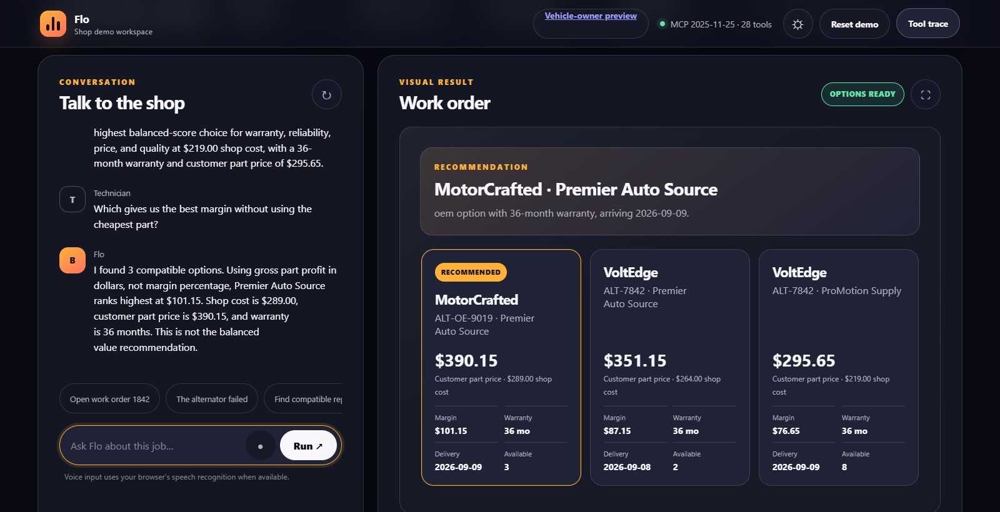
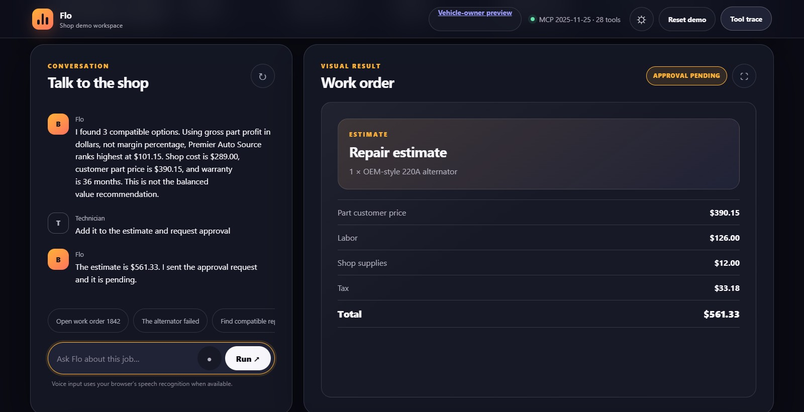
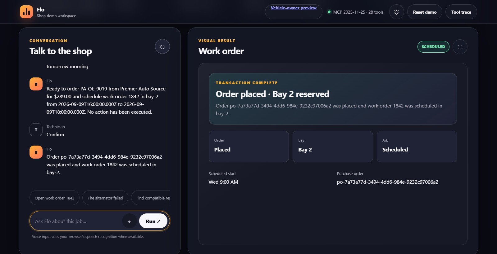

# Flo replacement cut — September 8, 2026

The owner separately approved the rendered cut, private upload and Public release.
The [replacement video](https://www.youtube.com/watch?v=5BxqSCW_XNc) is Public.
Studio saved that status; the watch page played and displayed the uploaded English
caption track in the signed-in browser. An independent web fetch was throttled,
so signed-out playback is not claimed. YouTube's automatic thumbnail is retained
at the owner's request. The Devpost portfolio page is public, but the event entry
still has no submission timestamp as of this checkpoint.

## Asset identity

- File: `Flo-demo-2026-09-08.mp4` (maintainer's release output; not stored in Git).
- SHA-256: `48e4b9a7fbf5319401d032f4f2d729c58b7ee1efb30a6210cbbb85caa7606f38`.
- Encoded duration: 173.99 seconds; 1920 × 1080, 30 fps, H.264 and 48 kHz AAC.
- Same original TTS voice: `en-GB-RyanNeural`, rate `-7%`, pitch `-4Hz`.
- [English SRT](flo-demo-2026-09-08.en.srt) and [English VTT](flo-demo-2026-09-08.en.vtt):
  46 timed cues, matching the replacement narration, with punctuation restored.
- Captions are also burned into the review MP4. No background music or stock footage.
- Source: `10c65fb` plus estimate-view fix `578fdcd8677d1411106d2a4730c210e6bbfaaf4e`; subsequent release-document
  changes do not change the captured application behavior.

The old `ZjROvjL2smo` video and its captions remain historical and unchanged.

## Actual contents

1. Hands-busy repair operations; custom Alexa-style simulation, not a live Alexa device.
2. Public signed-out AWS customer page, followed by a clearly labeled dated evidence
   card. No fresh authenticated session, identity token or pairing code is shown.
3. Real local tool execution: work order 1842, diagnosis and compatible supplier search.
4. Balanced $219 shop-cost choice versus $289 highest gross-dollar-profit choice;
   this is not a claim of highest margin percentage.
5. Correct selected-part price $390.15 and estimate $561.33, local owner preview,
   explicitly simulated approval, then resumed context in a new conversation.
6. Prepare, confirm, actual mock order and Bay 2 reservation, then rejected repeat.
7. Architecture boundaries: optional Bedrock narration not invoked in this capture;
   hosted auth/projections separate from in-memory shop state; AgentCore and official
   Alexa integration/testing/certification remain incomplete.

Title cards are explanatory graphics. Application shots are captured UI; one
successful transaction frame is held longer to align the edited sequence with
narration before the duplicate-denial shot. No success state is fabricated.

## Checks and remaining gates

The corrected simulator was rebuilt in local Docker before the full workflow was
recorded. Assertions checked the selected price/total, approval, resumed job,
prepared confirmation, successful schedule and HTTP 400 for repeated confirmation.
Local compilation/application tests, script tests, ESLint and typecheck passed.
The script suite reported 94 tests: 88 passed, six POSIX-only Windows skips.
These local results do not replace the final commit's Linux CI/Docker checks.

FFmpeg decoded the complete encoded MP4 successfully. Its measured audio was
approximately -16.3 LUFS integrated with -1.28 dBTP true peak. Independent automated
transcription checked the encoded narration, not just the script; proper-name
recognition was imperfect, so it was not used as the caption source. Frame review
covered all twelve sections and corrected title-card styling and caption placement.
The owner then approved the cut. Automated transcription is not a claim of a
separate professional human audio review.

Local browser QA used headless Edge/Playwright at 1600 × 820 because the Browser
plugin was unavailable. The page/title, nonblank content and work-order interaction
were checked; no page exceptions occurred. A missing `/favicon.ico` caused a
non-blocking console 404. Mobile and official Alexa surfaces were not tested here.

Release source `c63121b` passed [CI verification and Docker jobs](https://github.com/agammann/flo/actions/runs/34201132288).
The owner approved publication after cut review. Title, description, English
subtitle track and “not made for kids” were saved. No custom thumbnail was requested
for the final release. The new video URL is saved on [Flo's Devpost page](https://devpost.com/software/flo-yozfdv).
Final hackathon submission remains a separate approval and verified action.

## Actual local UI shots

